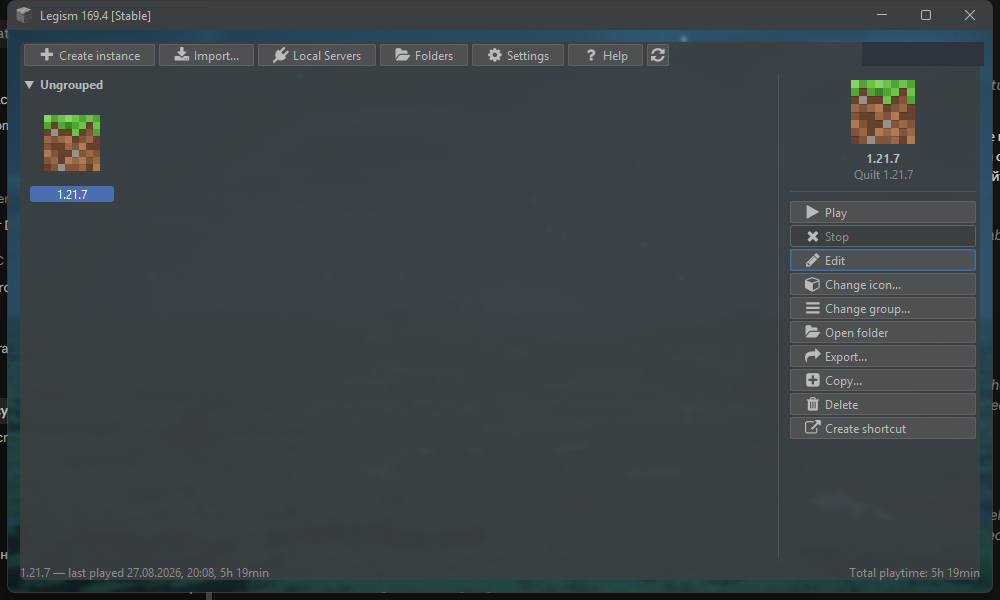
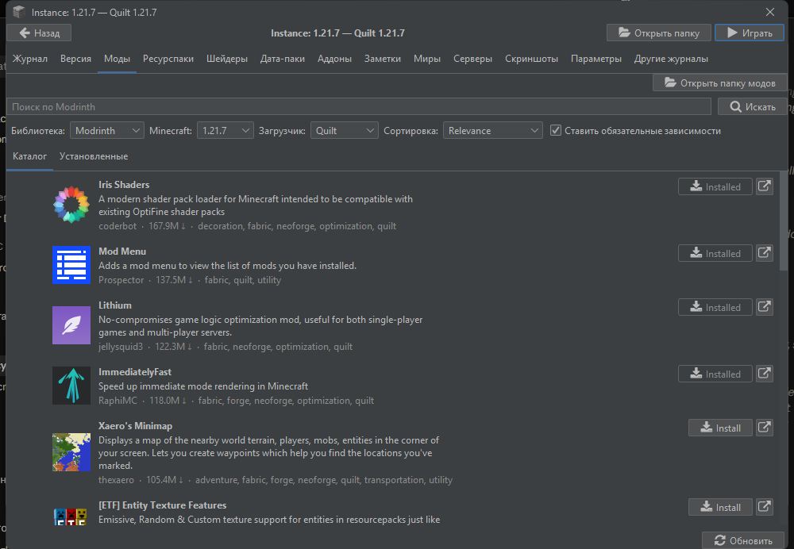

<div align="center">


<h1>
<a href="https://legism.github.io/">Legism</a>
</h1>

Лаунчер Minecraft **без рекламы и телеметрии**, с офлайн-аккаунтами и Ely.by,<br>
модами и сборками из **Modrinth, CurseForge, FTB, Technic и ATLauncher** в один клик

Форк [Legacy Launcher](https://llaun.ch/) — **не** связан с его командой и не одобрен ею

<p align="center">
<a href="./README.md">English</a> | <strong>Русский</strong>
</p>

<div>

[](https://github.com/Legismmc/legism/releases/latest)
[](https://github.com/Legismmc/legism/releases)
[](https://github.com/Legismmc/legism/stargazers)


</div>

</div>

## Скриншоты

<details>
  <summary>Показать</summary>

  <div align="center">
    
    
  </div>

</details>

## Возможности

- **Без рекламы и телеметрии.** Убраны все баннеры, рекламные серверы и трекинг, которые были в исходном лаунчере
- **Игра офлайн** без аккаунта Microsoft или вход через [Ely.by](https://ely.by/) — скин виден в игре без всяких модов
- **Сборки** — у каждой свои моды, ресурспаки, шейдеры, миры, настройки и время в игре, и они никогда не мешают друг другу
- **Каталог модов** Modrinth и CurseForge: моды, ресурспаки, шейдеры, дата-паки; обязательные зависимости ставятся сами, а **«Обновить всё»** обновляет всё одной кнопкой
- **Модпаки из пяти библиотек** — Modrinth, CurseForge, FTB, Technic и ATLauncher — ставятся сразу с аватаркой сборки
- **Обновление модпаков** со списком изменений каждой версии; ваши моды, миры и настройки сохраняются
- Загрузки, которые **доходят до конца**: по десять файлов одновременно, со сверкой хэшей и повтором при обрыве соединения
- **Статус в Discord** с названием сборки, в которую вы играете
- **Обновление лаунчера в один клик**
- Разбор вылетов, локальные серверы, журналы, скриншоты и список серверов у каждой сборки
- Встроенные **настройки прокси** для сетей, где он нужен
- Интерфейс на русском и английском
- Сборки для **Windows, Linux и macOS** (Intel и Apple Silicon)

## Сравнение

| Возможность                                    | Legism            | Legacy Launcher | Prism Launcher |
|------------------------------------------------|-------------------|-----------------|----------------|
| Офлайн-режим без аккаунта Microsoft            | ✅                | ✅              | ❌             |
| Аккаунты Ely.by                                | ✅                | ✅              | ❌             |
| Без рекламы и телеметрии                       | ✅                | ❌              | ✅             |
| Отдельные сборки (инстансы)                    | ✅                | ❌              | ✅             |
| Встроенный каталог Modrinth и CurseForge       | ✅                | ❌              | ✅             |
| Модпаки FTB, Technic и ATLauncher              | ✅                | ❌              | ✅             |
| Обновление модпаков со списком изменений       | ✅                | ❌              | ✅             |
| Локальные серверы                              | ✅                | ✅              | ❌             |
| Статус в Discord                               | ✅                | ❌              | ❌             |
| Основан на                                     | Legacy Launcher   | —               | PolyMC         |

## Установка

### Стабильные версии

Скачайте Legism с [официального сайта](https://legism.github.io/) или со страницы [GitHub Releases](https://github.com/Legismmc/legism/releases/latest):

| Система                | Файл                               |
|------------------------|------------------------------------|
| Windows                | `Legism_windows_installer.exe`     |
| Windows (портативная)  | `Legism_windows_portable.zip`      |
| Linux                  | `Legism_linux.tar.gz`              |
| macOS (Apple Silicon)  | `Legism_macos_apple_silicon.dmg`   |
| macOS (Intel)          | `Legism_macos_intel.dmg`           |

В каждой сборке есть своя Java — ничего дополнительно ставить не нужно. После установки лаунчер обновляется сам.

### Тестовые сборки

Каждый коммит в `main` собирается в [GitHub Actions](https://github.com/Legismmc/legism/actions), сборки прикреплены к запуску как артефакты. Они не для обычных игроков и могут не работать. Вы предупреждены.

## Сообщество и поддержка

Нашли ошибку или хотите предложить идею? Создайте issue в [GitHub Issues](https://github.com/Legismmc/legism/issues). Pull request’ы приветствуются.

[](https://t.me/legismmc)
[](https://discord.gg/csBAgdRuv)

## Сборка из исходников

Нужен JDK 21. `SHORT_BRAND` должен отличаться от того, что публикует исходный проект, иначе загрузчик заменит эту сборку оригинальной — опубликованные сборки используют `tgsko`.

Портативная сборка (папка с `LL.exe` и встроенной JRE):

```bash
SHORT_BRAND=tgsko PORTABLE_ENABLED=true ./gradlew :packages:portable:createPortableBuild
```

Установщик для Windows — готовит дерево Inno Setup, которое затем компилирует [Inno Setup 6](https://jrsoftware.org/isdl.php):

```bash
SHORT_BRAND=tgsko PORTABLE_ENABLED=true INSTALLER_ENABLED=true ./gradlew :packages:installer:prepareInstaller
```

Сборки для Linux и macOS делают задачи `:packages:linux:createLinuxBuild` и `:packages:dmg:assemble`; точные шаги для каждой системы — в [`.github/workflows/build.yml`](.github/workflows/build.yml).

Название, бренд и почта поддержки задаются в `buildSrc/src/main/kotlin/net/legacylauncher/gradle/LegacyLauncherBrandPlugin.kt` и переопределяются переменными окружения `PRODUCT_NAME`, `SHORT_BRAND` и `SUPPORT_EMAIL`.

## Авторы

- [tgskoZ](https://github.com/tgskoZ) — разработчик
- [junekq](https://github.com/junekq) — Java-разработчик

## Прочее

<ul>
  <li>Мы <strong>НЕ</strong> связаны с командой <a href="https://llaun.ch/">Legacy Launcher</a>. Пожалуйста, не отправляйте им сообщения об ошибках в этой сборке.</li>
  <li>Мы <strong>НЕ</strong> собираем ваши данные: телеметрия исходного лаунчера отключена и пишет только в локальный журнал.</li>
  <li>Мы <strong>УВАЖАЕМ</strong> авторов модов: файлы, которые авторы разрешают качать только через приложение CurseForge, не скачиваются в обход — лаунчер даёт ссылку на них.</li>
  <li>Мы <strong>ОТКРЫТЫ</strong> для участия в проекте.</li>
</ul>

## Лицензия

См. [LICENSE.txt](LICENSE.txt). Исходный проект сохраняет за собой все права; этот форк наследует эти условия и ничего не перелицензирует.
